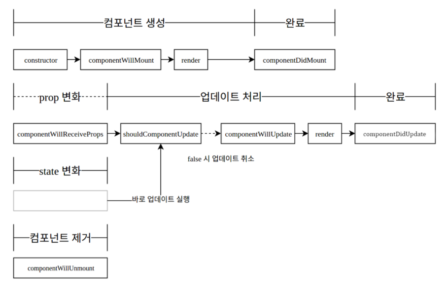

# 20. LifeCycle API

- 생명 주기
- 밑의 중간 과정에서 어떤 작업을 하고 싶을 때 사용.

1. 컴포넌트가 나타날때
2. 없데이트 될 때
3. 사라질 때



- Munting : 컴포넌트가 우리 브라우저상에 나타나는 것을 의미
  - constructor : 생성자 함수, 브라우저 상에서 컴포넌트가 만들어지는 과정에서 가장 먼저 실행되는 함수
    - state 등 초기 설정을 하거나 미리 해야되는 작업을 수행
    - getDerivedStateFromProps : 프롭스로 받은 값을 state에다가 그대로 동기화하고 싶을 때
      - Updating 주기에도 프롭스가 변경될 때 실행 된다.
    - render : 어떤 DOM을 만들게 될지, 내부에 있는 태그들에 어떤 값을 전달하게 될지 정의해준다.
    - componentDidMount : 브라우저에 컴포넌트가 나타나게 되면 호출되는 함수
      - 외부 라이브러리(차트 등)를 사용해 특정 돔에다가 그려주세요!
      - ajax를 이용하여 api 요청
      - 컴포넌트가 나타난 다음 이벤트나 몇초 뒤 무언가를 하고 싶을 때
      - 컴포넌트가 나타난 시점에 어떤 것을 하고싶다! 할 때 사용
      - 이벤트 리스닝도 사용.
- Updating : 컴포넌트의 프롭스나 스테이트가 변경되었을 때
  - shouldComponetUpdate (중요) : 컴포넌트가 업데이트 되는 성능을 최적화시키고 싶을 때
    - 원래는 컴포넌트는 기본적으로 부모 컴포넌트가 리렌더링 되면 자식 컴포넌트들 도 다 렌더 함수가 실행되게 되어 있다.
    - 이 작업이 불필요할 때가 있다.
    - 리엑트의 virtual dom에서 배웠던 기억은 컴포넌트가 실제로 업데이트 된것만 바꾸기 때문에 렌더링 과정이 빠르다. 즉 렌더 함수는 호출은 되지만 실제 브라우저 돔상에는 반영이 되지 않는 것이다. 실제 브라우저 돔상에는 바뀌는 것만 업데이트하는 것이다. 하지만 일단 render함수는 virtual dom상에서는 그리기는 한다. 부모 컴포넌트가 변경되면 자식도 렌더링해 virtual dom에 그리게 되고 브라우저 돔과 비교해서 바뀐 것만 업데이트 하는 것이다.
    - 하지만 virtual dom 상에서도 성능을 아끼고 싶을때 사용한다. 컴포넌트가 몇백개, 몇천개가 될 때 성능 최적화!
    - true와 false값을 반환할 수 있다. true(랜더 수행), false(랜더 비실행)
  -   getSnapshotBeforeUpdate : 우리가 렌더링 한 다음에 결과물이 브라우저에 반영되기 바로 직전 호출되는 함수
    - 스크롤의 위치나 해당 돔의 크기를 사전에 가져오고 싶다할 때 사용
  - componentDidUpdate : 모든 작업을 마치고 컴포넌트가 업데이트 되었을 때 호출되는 함수
    - state가 변경하였을 때 이전의 상태와 현재의 상태(ex 페이지)를 비교해서 어떤 작업을 할 때
- Unmounting : 컴포넌트가 브라우저상에서 사라질때 과정
  - componentWillUnmount : 컴포넌트가 사라지는 과정에서 호출되는 함수
    - 우리가 만든 돔에서 클릭이벤트 등 componentDidMount에서 특정 이벤트를 리스너했지만 여기서는 저기서 설정한 리스너를 없애주는 작업을 실행한다.


#### 1. constructor

- 브라우저에 나타나기 전, 후에 호출되는 API

```javascript
import React, { Component, Fragment } from 'react';

class App extends Component {
  constructor(props){
      super(props); //원래 가지고 있던 생성자함수를 호출
      console.log('constructor');
  }
  render() {
    return (
      <div>
        <h1>안녕하세요 리액트</h1>
      </div>
    );
  }
}

export default App;
```


### 2. componentDidMount

- 컴포넌트가 화면에 나타나게 됬을 때 호출

- 외부 라이브러리 연동 : D3, masonry, etc
- 컴포넌트에 필요한 데이터 요청 : Ajax, GraphQL, etc
- DOM에 관련된 작업 : 스크롤 설정, 크기 읽어오기

```javascript
import React, { Component, Fragment } from 'react';

class App extends Component {
  constructor(props){
      super(props); //원래 가지고 있던 생성자함수를 호출
      console.log('constructor');
  }
    
  componentDidMount() {
      console.log('componentDidMount')
      //특정 돔의 크기를 확인이 가능하다(ref를 이용)
      console.log(this.myDiv.getBoundingClientRect().height);
  }
    
  render() {
    return (
      <div ref={ref => this.myDiv = ref}>
        <h1>안녕하세요 리액트</h1>
      </div>
    );
  }
}

export default App;
```


### 3. getDerivedStateFromPorps()

- v16.3 이후 만들어졌다.
- props로 받아온 값을 state로 동기화하는 작업을 해줘야 할 때 사용
- 업데이트되는 과정과 컴포넌트가 만들어지는 과정에서도 사용


- 새로운 컴포넌트 생성, MyComponent.js

```javascript
import React, { Component, Fragment } from 'react';

class MyComponent extends Component {
  state = {
      value: 0
  };
	
  static getDerivedStateFromPorps(nextProps, prevState) {
      if(prevState.value !== nextProps.value){
          return {
              value: nextProps.value
              //state값과 props값이 같아진다.
          }
      }
      return null;
  }

  render() {
    return (
      <div>
        <p>props: {this.props.value}</p> //5
		<p>state: {this.state.value}</p> //0->5 (바뀐다. 위 함수덕분에..)
      </div>
    );
  }
}

export default App;
```


- app 컴포넌트

```javascript
import React, { Component, Fragment } from 'react';
import MyComponent from './MyCoponent';

class App extends Component {
  state = {
      counter: 1,
  }
  constructor(props){
      super(props); //원래 가지고 있던 생성자함수를 호출
      console.log('constructor');
  }
    
  componentDidMount() {
      console.log('componentDidMount')
      //특정 돔의 크기를 확인이 가능하다(ref를 이용)
      console.log(this.myDiv.getBoundingClientRect().height);
  }
  
  handClick = () => {
      this.setState({
          counter: this.state.counter + 1
      });
  };
  render() {
    return (
      <div>
        <MyComonent value={this.state.counter}/>
		<button onClick={this.handleClick}>Click Me</button>
		//두개의 스테이트와 프롭스 연동 및 변경
      </div>
    );
  }
}

export default App;
```


### 4. shouldCompoentUpdate

- 컴포넌트의 업데이트 성능을 최적화
- return false, true(업데이트 유무 결정)

```javascript
import React, { Component, Fragment } from 'react';

class MyComponent extends Component {
  state = {
      value: 0
  };
	
  static getDerivedStateFromPorps(nextProps, prevState) {
      if(prevState.value !== nextProps.value){
          return {
              value: nextProps.value
              //state값과 props값이 같아진다.
          }
      }
      return null;
  }

  shouldComponentUpdate(nextProps, nextState){
      if (nextProps.value === 10) return false;
      return true;
  }

  render() {
    return (
      <div>
        <p>props: {this.props.value}</p> // 추가시 10일때 업데이트안됨, 렌더링을 안하는 것
		<p>state: {this.state.value}</p> //
      </div>
    );
  }
}

export default App;
```


### 4. getSnapshotBeforeUpdate()

- 컴포넌트가 업데이트 되어서 브라우저 DOM에 반영되기 직전 호출된다.
- DOM 상태를 리턴시켜서 리턴된 값을 componentDidUpdate에서 받아올 수 있다.
- 업데이트 직전에 스크롤 위치와 크기를 가져와서 이 값을 리턴하고 componentDidUpdate에서 3번째 파라미터로 받아와서 스크롤 위치를 설정해 우리가 보고 있는 것을 유지할 수 있다.

```javascript
getSnapshotBeforeUpdate(prevProps, prevState) {
	if(prevState.array !== this.state.array){
        const {
            scrollTop, scrollHeight
        } = this.list;
    }
    
    return {
        scroppTop, scrollHeight
    };
}

componentDidUpdate(prevProps, prevState, snapshot){
    if (snapshot) {
        const { scrollTop } = this.list;
        if( scrollTop !== snapshot.scrollTop) return; //기능이 이미 구현되어있으면 처리 x
        const diff = this.list.scrollHeight - snapshot.scrollHeight;
        this.list.scrollTop += diff;
    }
}
```


### 5. componentDidUpdate

- 컴포넌트가 실제로 업데이트 되고 난 후 호출 된다.

```
componentDidUpdate(prevProps, prevState, snapshot){
	//특정 프롭스가 바뀌면 어떠한 작업을 하게끔 하기.
}
```

```javascript
import React, { Component, Fragment } from 'react';

class MyComponent extends Component {
  state = {
      value: 0
  };
	
  static getDerivedStateFromPorps(nextProps, prevState) {
      if(prevState.value !== nextProps.value){
          return {
              value: nextProps.value
              //state값과 props값이 같아진다.
          }
      }
      return null;
  }

  shouldComponentUpdate(nextProps, nextState){
      if (nextProps.value === 10) return false;
      return true;
  }

  componentDidUpdate(prevProps, prevState){
      if(this.props.value !== preProps.value){
          console.log('value 값이 바뀌었다.', this.props.value)
      }
  }

  render() {
    return (
      <div>
        <p>props: {this.props.value}</p> // 추가시 10일때 업데이트안됨, 렌더링을 안하는 것
		<p>state: {this.state.value}</p> //
      </div>
    );
  }
}

export default App;
```


### 6. componentWillUnmount

- 컴포넌트가 불필오해지면 그 때 사라질 때 나타나는 함수

```javascript
import React, { Component, Fragment } from 'react';

class MyComponent extends Component {
  state = {
      value: 0
  };
	
  static getDerivedStateFromPorps(nextProps, prevState) {
      if(prevState.value !== nextProps.value){
          return {
              value: nextProps.value
              //state값과 props값이 같아진다.
          }
      }
      return null;
  }

  shouldComponentUpdate(nextProps, nextState){
      if (nextProps.value === 10) return false;
      return true;
  }

  componentDidUpdate(prevProps, prevState){
      if(this.props.value !== preProps.value){
          console.log('value 값이 바뀌었다.', this.props.value)
      }
  }

  componehtWillUnmount(){
      console.log('Good Bye');
  }

  render() {
    return (
      <div>
        <p>props: {this.props.value}</p> // 추가시 10일때 업데이트안됨, 렌더링을 안하는 것
		<p>state: {this.state.value}</p> //
      </div>
    );
  }
}

export default MyComponent;
```

```javascript
import React, { Component, Fragment } from 'react';
import MyComponent from './MyCoponent';

class App extends Component {
  state = {
      counter: 1,
  }
  constructor(props){
      super(props); //원래 가지고 있던 생성자함수를 호출
      console.log('constructor');
  }
    
  componentDidMount() {
      console.log('componentDidMount')
      //특정 돔의 크기를 확인이 가능하다(ref를 이용)
      console.log(this.myDiv.getBoundingClientRect().height);
  }
  
  handClick = () => {
      this.setState({
          counter: this.state.counter + 1
      });
  };
  render() {
    return (
      <div>
        //저 조건이 만족하면 컴포넌트를 보여줘라!
        //10이되서 사라지면 goodby가 나타난다.
        { this.state.counter < 10 && <MyComonent value={this.state.counter}/> }
		<button onClick={this.handleClick}>Click Me</button>
		//두개의 스테이트와 프롭스 연동 및 변경
      </div>
    );
  }
}

export default App;
```


### 7. componentDidCatch

- 컴포넌트에 에러가 발생했을 때
- 예를 들어서 컴포넌트 클래스에서 render 함수에서 오류 발생(존재하지 않는 값을 보여줄 때)
- 서버로 에러 전송할때도 사용
- 실수로 잡지 못했던 에러와 버그를 찾을 때
- 자식컴포넌트를 사용하고 있는 부모 컴포넌트에서 에러를 처리해야줘야 한다.

```javascript
import React, { Component, Fragment } from 'react';
import MyComponent from './MyCoponent';

class App extends Component {
  state = {
      counter: 1,
      error: false
  }
  constructor(props){
      super(props);
      console.log('constructor');
  }
    
  componentDidMount() {
      console.log('componentDidMount')
      console.log(this.myDiv.getBoundingClientRect().height);
  }
  
  handClick = () => {
      this.setState({
          counter: this.state.counter + 1
      });
  };
  
  componentDidCatch(error, info){
      console.log(error); //무슨에러인지
      console.log(info); //어디서 발생했는지
      this.setState({
          error: true;
      });
      //API를 통해서 서버로 오류 내용 날리기
  }
  render() {
    if(this.state.error){
        return(
            //개발모드애서는 에러가 뜨지만 사용자가 볼대는 이것이 보인다!
        	<div>에러가 났어요!</div>
        )
    }
    return (
      <div>
        //존재하지 않는값 렌더시 오류 발생
        //자식컴포넌트를 사용하고 있는 부모 컴포넌트에서 에러를 처리해야줘야 한다.
        {this.props.missing.something}
      </div>
    );
  }
}

export default App;
```

- Sentry를 이용하면 대시드보드로 에러를 보고 관리할 수 있다.
  - 사용자가 발견한 에러들을 알 수 있다.